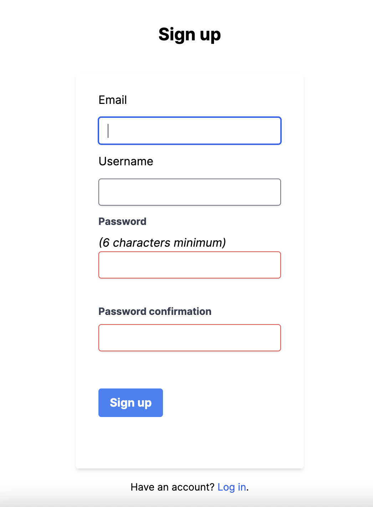
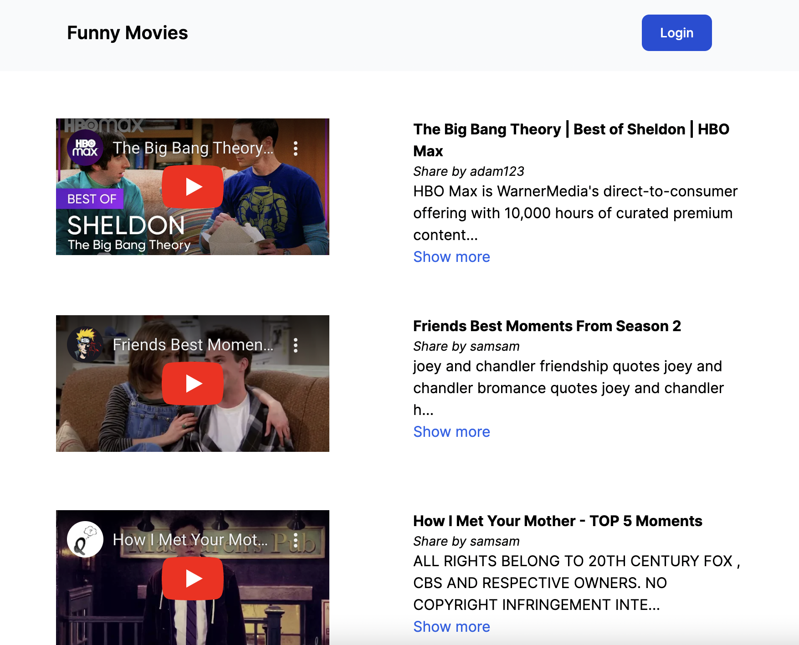
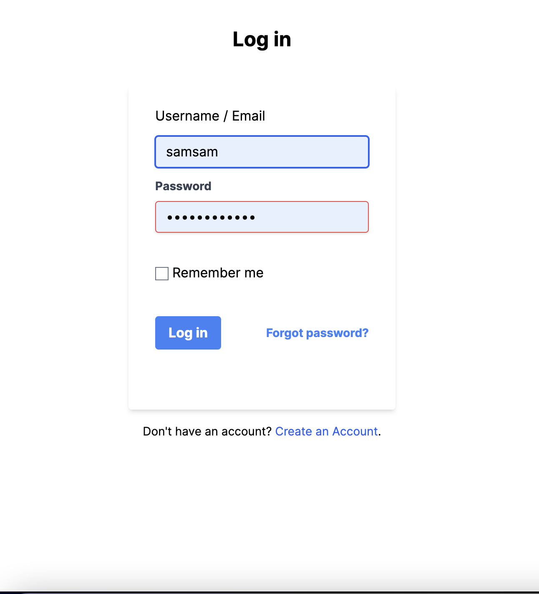
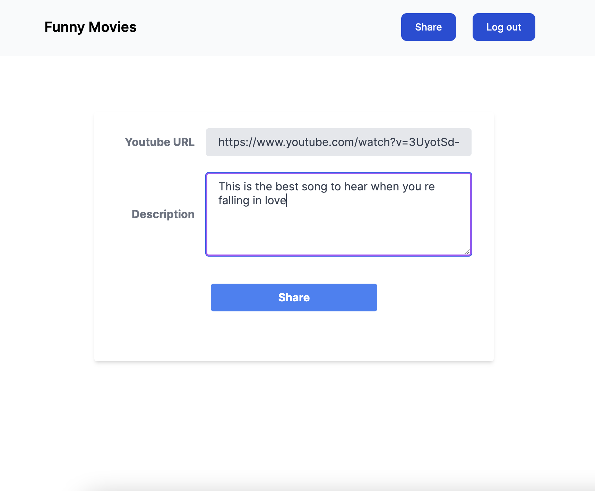
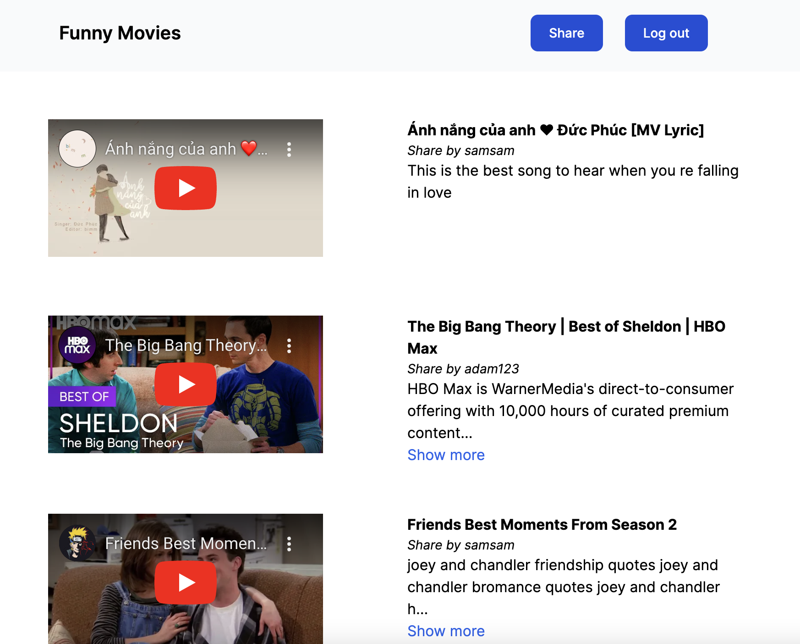
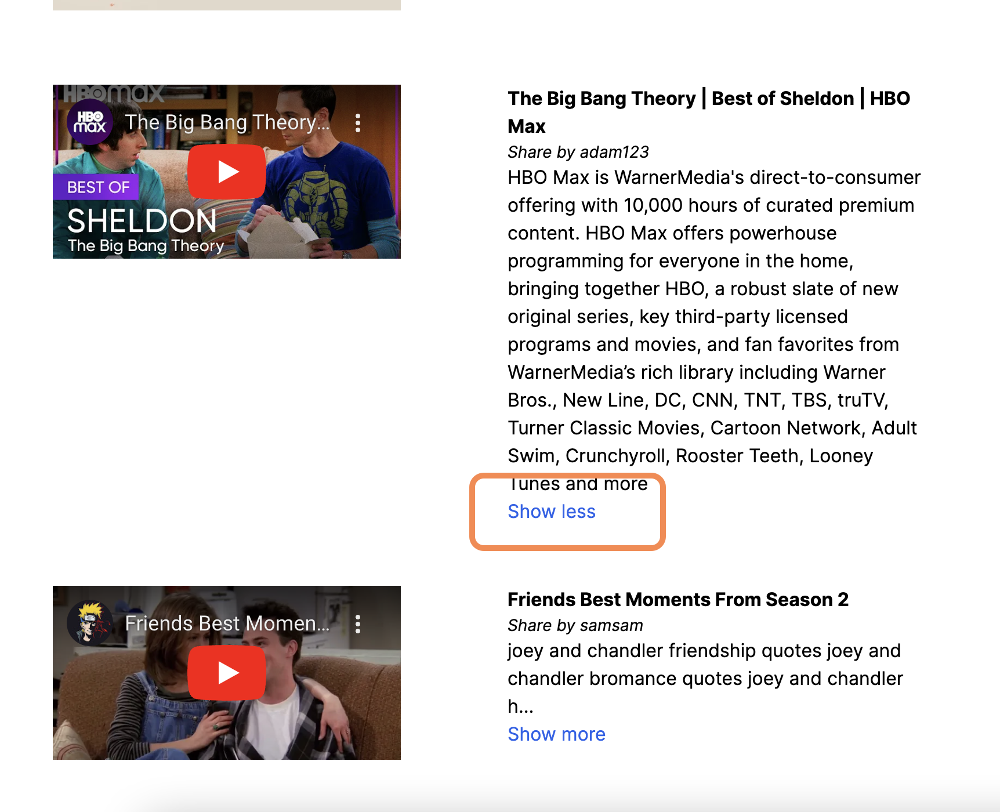

# Buggy

Youtube link sharing newfeed.

Use Rails7 (Ruby3.1.1) + Stimulus for js (quite interesting)

## Database: Postgresql

### Run

By docker on port 5432.

```
docker compose up
```

### Rails setup

```
./bin/rails db:create
./bin/rails db:migrate
./bin/rails db:seed:replant
./bin/rails db:rollback STEP=x
```

### Model observe: Annotate

```
./bin/bundle add annotate --group development
./bin/rails g annotate:install
```

## User management: Devise

```
./bin/bundle add devise
./bin/rails g devise:install
./bin/rails g devise User
./bin/rails g devise:views
```

### Add username to user (for login by email/username)

```
./bin/rails g migration add_username_to_users username:string:uniq
./bin/rails db:migrate
```

## Formatting: Rubocop

```
./bin/bundle add rubocop rubocop-rails rubocop-rspec -g development -g test
```

## Interface CSS: Tailwindcss

```
./bin/bundle add tailwindcss-rails
./bin/rails tailwindcss:install
```

## Create page and controller

### Controller: Home

```
./bin/rails g controller Home index
```

### Model: Medium

```
./bin/rails g model Medium title:string url:string:not_null description:text user:references
./bin/rails db:migrate
```

### Controller: Sharing

```
./bin/rails g controller Sharing create
```

## Pagination: Kaminari

```
./bin/bundle add kaminari
./bin/rails g kaminari:config
./bin/rails g kaminari:views default -e erb
```

## Test: RSpec

```
# Gemfile
gem 'rspec-rails', '~> 6.0.0.rc1'

./bin/bundle

./bin/rails g rspec:install

./bin/bundle add factory_bot_rails

# for integration test
./bin/bundle add apparition launchy capybara--group test
```

Generate test model

```
./bin/rails g rspec:model user
./bin/rails g rspec:model medium
```

Test

```
./bin/bundle exec rspec
```

## Other

### HttpClient: Faraday

```
./bin/bundle add faraday faraday-net_http
```

## Sample image

<p align="middle">
  
  
  
</p>
<p align="middle">
  
  
  
</p>
<p align="middle">
  
  
</p>

xxxTESTxxx
